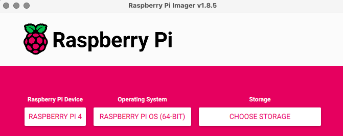
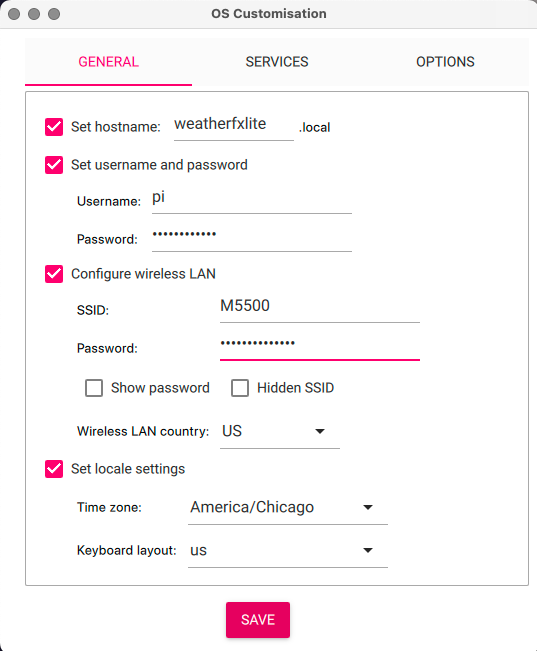

# Building on Raspberry Pi

These instructions are for Raspberry Pi OS based upon Debian
Bookworm.

## Hardware

* Raspberry Pi 4
* Hyperpixel 4.0 Square
* 32GB microSD

## Imaging

The [Raspberry Pi Imager](https://www.raspberrypi.com/software/) software
is the easiest way to get started.  

<div align="center">

</div>

I recommend using the **OS Customization** option to configure your
hostname, Wi-Fi, timezone, and SSH keys.

<div align="center">

</div>

## Obtaining

SSH into your newly imaged Pi, and

```bash
git clone https://github.com/iachievedit/weatherfxlite
```

## Building

> [!IMPORTANT]  
> You must have a suitable `config.h` in place at this point.

You can run `build.sh` to build everything on the Raspberry Pi.
If this is the first time running `build.sh` on a new Pi, it is
recommended to run `sudo apt-get update` first.

```bash
cd weatherfxlite
sudo apt-get update
./build.sh
```

If everything builds correctly, you'll see something like:

```bash
clang++ -Wl,-O1 -o build/weatherfxLite build/.obj/WeatherKitAPI.o build/.obj/main.o build/.obj/FileDownloader.o build/.obj/WeatherFXLite.o build/.obj/WindArrow.o build/.obj/moc_WeatherKitAPI.o build/.obj/moc_FileDownloader.o build/.obj/moc_WeatherFXLite.o   -L/usr/include/lib -lcrypto /usr/lib/aarch64-linux-gnu/libQt5Widgets.so /usr/lib/aarch64-linux-gnu/libQt5Gui.so /usr/lib/aarch64-linux-gnu/libQt5Network.so /usr/lib/aarch64-linux-gnu/libQt5Core.so -lGL -lpthread
```

## Installing

To turn your Pi 4 into a WeatherFXLite display, run `pi4_setup.sh`.

This script runs a number of commands to:

* Initialize the Hyperpixel 4.0 display
* Prevent the display from going to sleep
* Hide the mouse cursor under Wayland

After running `pi4_setup.sh`, reboot your Pi.

## Tweaks

The latest Raspberry Pi OS based upon Bookworm requires little in the way
of configuring the Hyperpixel 4.0 display.  It is initialized by

```
dtoverlay=vc4-kms-dpi-hyperpixel4sq
```

in `/boot/firmware/config.txt`.

If necessary, you can rotate the display to be "upside down"
by changing the above to:

```
dtoverlay=vc4-kms-dpi-hyperpixel4sq,rotate=180
```

Changes to `/boot/firmware/config.txt` will require a reboot.